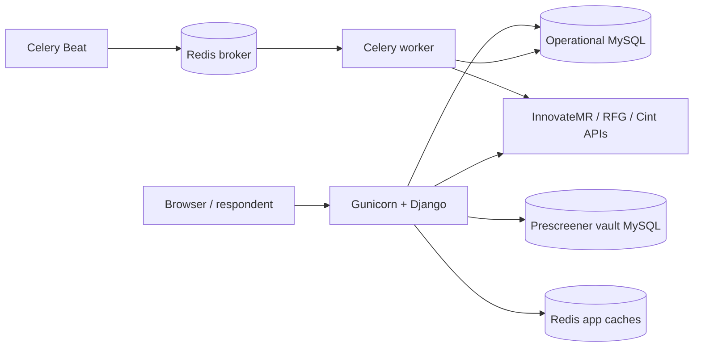

# Quest Tool developer handbook

This is the maintenance map for the production codebase. Read it before changing
provider identifiers, respondent redirects, synchronization, permissions, or the
prescreener vault. The shorter topic documents in this folder remain the source
for deployment-specific instructions; this handbook connects those topics to the
actual files and call chains.

## 1. Rules that protect production data

1. `Survey.local_id` is the platform Project ID. Never rebuild or change it after
   a survey is created.
2. `Survey.source_key` is the upstream client's survey identifier. It is unique
   only inside one `ClientIntegration`.
3. `SurveyAttempt.rid` is one respondent journey. It is exactly 10 mixed
   alphanumeric characters and must never be reused for another journey.
4. `SurveyAttempt.prescreener_uid` is the reusable profile identity. Its format is
   `XXXX-XXXX-XXXX-XXXX`. Do not silently swap it with RID.
5. The operational MySQL database owns surveys, attempts, access control and
   allocations. The prescreener-vault MySQL database owns reusable answers and
   Cint email identities. Redis is never authoritative.
6. Historical CPI comes from `SurveyAttempt.source_cpi_snapshot` and
   `payable_cpi_snapshot`, not the survey's current CPI.
7. Provider credentials are resolved server-side. Never serialize a token,
   secret, decrypted email, hash key, or Authorization header to the browser.
8. Callback verification and status finalization must use the existing services;
   writing a terminal status directly can leak or double-consume capacity.
9. Do not delete migrations or tests. Migrations describe production database
   history and tests protect contracts that are not obvious from the UI.

## 2. Runtime topology



- Gunicorn serves HTML, JSON APIs, copied links, prescreeners and callbacks.
- Celery Beat only schedules lightweight dispatch tasks.
- Celery workers perform provider inventory/detail synchronization, attempt
  reconciliation and allocation cleanup.
- Redis databases are separated for broker, result backend, general cache and
  Projects cache. An expired key causes a MySQL reload; it does not stop a service.

## 3. Directory and file map

### `accounts/` - people, roles and function permissions

| File | Responsibility |
|---|---|
| `models.py` | `AccessFunction`, `Role`, role-function grants, employee profile and per-user allow/deny overrides. |
| `function_catalog.py` | Code-owned list of every page/filter/card/column/action permission and default role grants. New UI/backend capabilities must be registered here. |
| `access.py` | Effective permission calculation, decorators, DRF permission class and organization-scoped visible/manageable user IDs. |
| `views.py` | Login/setup, Access Control page, Cint email-pool import and access-control API viewsets. |
| `serializers.py` | Validation and writes for roles, users, overrides, account type and organization placement. |
| `forms.py` | Login and first-super-admin setup forms. |
| `signals.py` | Ensures each Django user has an employee profile. |
| `context_processors.py` | Makes effective permissions/navigation state available to templates. |
| `management/commands/role_config.py` | Export, validate and import role definitions between Quest/Quant deployments. |
| `migrations/` | Immutable permission/model history and catalog seeds. |
| `tests.py` | Permission resolution, setup, delegation and email-pool UI authorization regressions. |

### `config/` - process configuration and root routing

| File | Responsibility |
|---|---|
| `settings.py` | Environment parsing, databases, Redis aliases, security flags, provider intervals and Celery schedule. |
| `urls.py` | Root URL composition plus protected Swagger/ReDoc/schema views. |
| `api_docs.py` | Dual documentation gate: Django admin-level session plus HTTP Basic credentials. |
| `cache_utils.py` | Fail-open cache wrappers, stable hashed keys and randomized TTLs. |
| `celery.py` | Celery app creation and startup credential reconciliation. |
| `wsgi.py` / `asgi.py` | Production application entry points. |

### `surveys/` - inventory, respondent journeys and reports

| File | Responsibility |
|---|---|
| `models.py` | Survey inventory, quota/targeting, canonical mapping, sync audit and respondent-attempt tables. |
| `integrations.py` | Legacy/dedicated InnovateMR HTTP client and endpoint response parsing. |
| `providers/base.py` | Provider adapter contract, normalized inventory DTO and safe configuration errors. |
| `providers/registry.py` | Resolves an integration's provider code to RFG/Cint adapters and exposes the provider catalog. |
| `providers/rfg.py` | RFG HMAC commands, inventory, targeting/quota hydration, duplicate check, local eligibility and outbound URL. |
| `providers/cint.py` | Cint Model 2/Method B inventory, question/quota hydration, supplier-link creation, PID/MID/email hashing and signed outbound URL. |
| `provider_services.py` | Generic provider preview, connection test, inventory upsert and bounded detail refresh. |
| `services.py` | InnovateMR inventory merge/upsert, quota/targeting replacement and transaction reconciliation. |
| `survey_flow.py` | RID/UID generation, IP/client audit, immutable attempt creation and generic InnovateMR outbound URL construction. |
| `mappings.py` | Canonical question/option mapping across providers and reverse conversion to provider answers. |
| `views.py` | HTML pages, prescreener controller, callback controllers, REST viewsets, exports and reporting endpoints. |
| `dashboard.py` | Permission-scoped dashboard query and graph aggregations. |
| `user_hits.py` | Hierarchy-scoped daily hit/complete/device aggregation. |
| `project_cache.py` | Versioned, permission-scoped Projects filter/count cache. |
| `filters.py` | DRF/django-filter query definitions for surveys and attempts. |
| `serializers.py` | Read API shapes and calculated presentation fields. |
| `tasks.py` | Celery integration dispatch, sync execution, detail refresh and pending-attempt reconciliation. |
| `outcomes.py` | Normalized platform outcome labels/reasons across clients. |
| `rfg_outcomes.py` / `rfg_text.py` | RFG result-code interpretation and cleanup of provider-encoded display text. |
| `excel.py` | Streaming-safe XLSX creation without depending on desktop Excel. |
| `urls.py` | Survey UI/public callback/REST routes. |
| `signals.py` | Invalidates Projects cache when relevant inventory changes. |
| `management/commands/sync_surveys.py` | Manual provider sync without Celery. |
| `management/commands/cache_health.py` | Non-destructive Redis write/read/delete health probe. |

### `prescreener_vault/` - isolated reusable respondent data

| File | Responsibility |
|---|---|
| `models.py` | Submission, question, value, encrypted Cint email and per-RID email-use rows in the vault database. |
| `router.py` | Forces vault models/migrations to the `prescreener_vault` database alias. |
| `services.py` | Canonical dimension detection, immutable answer snapshots, vault writes and reuse-count increments. |
| `cache.py` | Versioned filter/summary/profile cache over vault MySQL. |
| `cint_email_pool.py` | Real-email normalization/encryption, stable UID assignment, per-RID use audit and email hash delivery. |
| `management/commands/backfill_prescreener_vault.py` | Copies legacy operational answers to the vault idempotently. |
| `management/commands/cint_email_pool.py` | CLI import/status/disable operations for the Cint email pool. |
| `tests.py` / `test_cint_email_pool.py` | Cross-database immutability and concurrent identity-allocation contracts. |

### `vendors/` - suppliers, client integrations, organization and allocation

The Python package keeps its historical name `vendors` for migration/import
compatibility; the product UI calls these records Suppliers.

| File | Responsibility |
|---|---|
| `models.py` | Client, integration, supplier commercial policy/API keys, client/survey allocations, reservations, Branch/Sub-branch/Shift and client access. |
| `access.py` | Workspace ownership and organization hierarchy query helpers. |
| `services.py` | Client/survey allocation decisions, CPI cuts, reservation create/consume/release and supplier-visible survey scope. |
| `views.py` | Supplier CRUD, organization CRUD, client integration CRUD and management-page data APIs. |
| `serializers.py` | Validation for hierarchy, clients, credentials, policies, allocations and API keys. |
| `upstream.py` | Allow-listed, credential-safe provider API explorer operation catalog and execution. |
| `upstream_views.py` | Swagger-facing provider explorer endpoints. |
| `upstream_serializers.py` | Explorer request/response schemas. |
| `credentials.py` | Encrypts integration tokens, resolves env-backed secrets and clears stale integration data after a key change. |
| `authentication.py` | Hashed supplier API-key authentication. |
| `middleware.py` | Restricts panel pages according to supplier delivery mode. |
| `schema.py` | OpenAPI authentication extension and removal of unconfigured provider tags. |
| `tasks.py` | Expires abandoned allocation reservations. |

### Templates and browser code

| Path | Responsibility |
|---|---|
| `templates/surveys/base.html` | Shared authenticated shell/sidebar and static asset loading. |
| `templates/surveys/prescreener.html` | Public dynamic prescreener form. |
| `templates/surveys/status.html` | InnovateMR/Cint terminal status page. |
| `templates/surveys/rfg_result.html` | RFG-specific human-readable outcome page. |
| `templates/surveys/*.html` | Dashboard, Projects, Traffic Reports, Term Reports, User Hits and Panelist Data containers. |
| `static/surveys/app.js` | Sidebar behavior. |
| `static/surveys/projects.js` | Projects filters, pagination, rows/cards, Copy Link and quota/targeting drawer. |
| `static/surveys/studies.js` | Traffic Report filters, metrics, rows/cards and animations. |
| `static/surveys/user_hits.js` | Hierarchy filters and daily user-hit report. |
| `static/surveys/dashboard.js` | Dashboard fetch, filters, KPI animations and SVG charts. |
| `static/vendors/management.js` | Supplier/client/survey allocation and API-key modals. |
| `static/vendors/organization.js` | Organization tree, client catalog and client-access modals. |
| `static/accounts/access.js` | Role/user CRUD modals and grouped permission selection. |
| `static/**/*.css` | Responsive presentation only; authorization never depends on CSS visibility. |

### Deployment, generated schema and tests

- `deploy/supervisord.conf` defines the rootless production web, worker and Beat
  processes. `deploy/nginx/quest-tool.conf` is the reverse-proxy reference.
- `schema.yml` is the checked OpenAPI snapshot. Regenerate it after API schema
  changes; do not hand-edit provider operations into it.
- `test_*.py` and `tests.py` files are not temporary. They are excluded from
  runtime imports but run in CI/local verification. Removing them would not make
  the website immediately fail, but it would remove the safety net that detects
  broken permissions, callbacks, sync, exports, vault writes and provider URLs.

## 4. Identifier dictionary

| Name | Owner | Format | Stored at | Meaning |
|---|---|---|---|---|
| Project ID | Platform | 14 digits, `YYYYMM########` | `Survey.local_id` | Stable public project code. |
| Client Survey ID | Provider | String/numeric | `Survey.source_key` | Survey ID from InnovateMR, RFG or Cint. |
| Numeric source ID | Provider compatibility | Integer/nullable | `Survey.source_id` | Numeric mirror when the provider ID is numeric. |
| RID | Platform | 10 mixed alphanumeric | `SurveyAttempt.rid` | One attempt/journey and platform callback key. |
| UID | Platform vault | `XXXX-XXXX-XXXX-XXXX` | `SurveyAttempt.prescreener_uid` and vault submission | Persistent reusable profile identity. |
| User ID | Django | Integer | `SurveyAttempt.platform_user_id` | Employee who copied/started the link. |
| Supplier Code (public) | Platform | Usually `1000` | copied start URL | Masks the real provider supplier code from users. |
| Supplier Code (real) | Provider | Provider-defined | integration or entry link | Used only in server-to-provider calls. |

### Provider parameter mapping

| Provider | Outbound journey key | Persistent profile key | Callback key | Notes |
|---|---|---|---|---|
| InnovateMR | `PID=RID`, `trackId=RID` | Not sent as UID | `rid=trackId/PID` | Exact allocated entry link and real `supCode` stay server-side. |
| RFG | `rid=RID` | Not sent | Resolve canonical `rid` | Duplicate check also sends the attempt RID as RFG `rid`. |
| Cint | `MID=RID` | `PID=UID` | Supplier links return `MID` into local `rid` | `cint_email` is a SHA-256 hash stably assigned to UID; URL is HMAC-SHA1 signed. |

Do not infer meaning from capitalization alone. `RID` is our journey, while a
provider's field named `rid` or `PID` may intentionally contain our UID.

## 5. Main call chains

### Inventory synchronization

```text
Celery Beat
  -> surveys.tasks.dispatch_due_integrations
  -> surveys.tasks.sync_client_integration_task
  -> surveys.provider_services.sync_client_integration (RFG/Cint)
     or surveys.services.sync_surveys (InnovateMR)
  -> provider.inventory
  -> provider.normalize_inventory_item
  -> Survey upsert + SyncRun audit
  -> bounded provider.refresh_details
  -> quota/targeting replacement + canonical mappings
  -> Projects cache namespace invalidation
```

Manual `Sync now`, the management command and scheduled tasks converge on the
same service functions. This is why a sync bug should be fixed in the service or
adapter, not separately in the UI.

### Copy Link and attempt creation

```text
Projects Copy Link
  -> GET /survey/start?surveyId=...&supplierCode=1000&userId=...&code=...
  -> surveys.views.survey_start
  -> validate exact parameters, user access, survey identity and allocation
  -> surveys.survey_flow.create_attempt
  -> create RID + UID + CPI/IP/device snapshots atomically
  -> reserve allocation capacity when applicable
  -> redirect to /survey/start?rid={RID}
```

### Prescreener POST and provider redirect

```text
POST /survey/start (RID + answers)
  -> _collect_prescreener_answers
  -> capture_prescreener_submission (vault transaction)
  -> provider-specific validation / duplicate check
  -> select_for_update SurveyAttempt
  -> provider.build_outbound_url
  -> save immutable submitted/redirected timestamps and outbound URL
  -> HTTP 302 to provider
```

The redirect is intentionally blocked if the vault write fails. That prevents a
provider journey from existing without the answer/UID audit needed to reconcile
it later.

### InnovateMR branch

`survey_flow.build_outbound_url` parses the exact stored `entry_link`, replaces or
adds `PID=RID`, removes any stale `trackId`, appends `trackId=RID`, and adds
provider question values. `/survey?status=1..4&rid=RID` is handled by
`survey_status`. `reconcile_pending_attempts` is the fallback when old provider
redirects still point elsewhere.

### RFG branch

`ResearchForGoodProvider.validate_prescreener` applies local strict/relaxed
targeting. `duplicate_check` sends the attempt RID as RFG `rid`.
`build_outbound_url` converts age to birthday, validates gender/postal code, then
sends only `rid=RID`. The server callback enters `RFGCallbackAPIView.get`,
`_rfg_attempt_from_request` resolves that canonical RID, and the callback
transaction records the verified terminal outcome. `rfg_result` is browser
display only and cannot make a completion payable.

### Cint branch

`CintProvider.ensure_supplier_link` retrieves or creates an OWS supplier link whose
terminal URLs return Cint `MID` to local `rid`. `build_outbound_url` uses UID as
Cint `PID`, RID as Cint `MID`, obtains the UID's stable real-email hash from the
vault pool, appends qualification answers, signs the complete URL including its
trailing ampersand, and appends `hash`. A changed query order or missing trailing
ampersand changes the signature and will be rejected by Cint.

### Terminal outcome

```text
Provider callback/result
  -> locate SurveyAttempt by provider-mapped key
  -> lock attempt row
  -> preserve first terminal callback/time/IP/LOI
  -> store provider transaction/reason metadata
  -> finalize_attempt_capacity
     -> complete consumes reservation
     -> terminate/quota/security releases reservation
  -> reports read the same immutable attempt
```

## 6. Deep walkthrough: `surveys.views.survey_start`

This is the central respondent controller and the first function to inspect when
a copied link, prescreener or provider redirect fails.

1. On an initial GET it requires exactly `surveyId`, `supplierCode`, `userId` and
   `code`; unexpected parameters are rejected rather than ignored.
2. It resolves the user and checks active state plus effective Projects/Copy-Link
   permissions.
3. It resolves a live survey using both provider Survey ID and platform Project
   ID, preventing a mixed/tampered link.
4. It validates public supplier code and availability of an entry link (or a
   provider path capable of hydrating one).
5. `resolve_survey_access` applies supplier/client/survey quantity and hierarchy
   policy. If needed, `reserve_attempt_capacity` locks quantity before traffic is
   accepted.
6. `create_attempt` writes RID, UID, CPI snapshots, user, IP, browser/device/OS
   and supplier snapshot in one transaction.
7. It redirects to the canonical RID-only URL. From this point the original
   query cannot be edited to switch survey/user.
8. On canonical GET it validates RID shape, loads the linked active user and
   backfills missing entry audit fields without overwriting existing evidence.
9. `_prescreener_questions` builds provider-aware question controls and qualifying
   hints from stored targeting data.
10. On POST `_collect_prescreener_answers` validates required fields and converts
    UI values to stored/provider values.
11. RFG ensures UID exists even if the optional vault feature is disabled; normal
    enabled production then writes all providers to `capture_prescreener_submission`.
12. RFG local eligibility and duplicate checks may finish locally before redirect.
    Strict/relaxed behavior comes from integration config.
13. The attempt is locked with `select_for_update`. A second submit cannot create
    a second provider redirect after the status has changed from initiated.
14. The selected provider adapter builds its outbound URL. Generic/InnovateMR uses
    `survey_flow.build_outbound_url`; RFG/Cint use their adapters.
15. Answers, `submitted_at`, `redirected_at`, `outbound_url` and redirected status
    are committed together, then the browser receives the 302.
16. Vault errors keep the attempt initiated for retry. Safe `ProviderError` text
    may be shown; unexpected exceptions become a generic upstream-unavailable
    message and are logged server-side.

Connected functions: `_has_exact_query`, `_invalid_survey_link`,
`create_attempt`, `backfill_attempt_entry_audit`, `_prescreener_questions`,
`_collect_prescreener_answers`, `capture_prescreener_submission`,
`get_provider`, provider `validate_prescreener`/`duplicate_check`/
`build_outbound_url`, and allocation reservation/finalization services.

## 7. Fast debugging map

| Symptom | First files/functions to inspect |
|---|---|
| Survey missing after sync | `tasks.py`, `provider_services.sync_client_integration`, provider `inventory`/`normalize_inventory_item`, latest `SyncRun`. |
| Eye drawer has no quota/targeting | provider `refresh_details`, `SurveyQuota`, `TargetingQuestion`, detail timestamps. |
| Copy Link absent | `SurveyListSerializer`, Projects column/action permissions, allocation access and `entry_link`. |
| Prescreener does not open | `survey_start` initial GET validation and `create_attempt`. |
| Prescreener submits but provider does not open | vault availability, provider `build_outbound_url`, attempt `outbound_url`, web logs. |
| RFG callback not found | confirm RFG `rid` contains the platform attempt RID; inspect `_rfg_attempt_from_request`. |
| Cint signature rejected | confirm stable hash key, query order, UID/PID, RID/MID, email pool and trailing ampersand. |
| Status stays initiated/redirected | callback URLs, `survey_status`/RFG callback, worker reconciliation and callback IP/security. |
| Wrong LOI | compare `initiated_at`, first `callback_at` and provider transaction end time; do not use current time. |
| Wrong CPI/revenue | inspect attempt CPI snapshots and visibility percentage, not current survey CPI. |
| TL sees another sub-branch | `accounts.access.activity_visible_user_ids` and organization-unit assignments. |
| Client visibility leaks | `vendors.access`, `visible_client_ids`, organization client grants and supplier allocations. |
| UI control hidden/403 | effective function codes, `function_catalog.py`, template condition and backend permission enforcement. |
| Slow Projects filters | `project_cache.py`, Redis DB 3 health and authoritative SQL query plan. |

## 8. Adding or changing a provider safely

1. Add provider-specific HTTP/normalization logic under `surveys/providers/`.
2. Implement the `SurveyProvider` contract and register it in `registry.py`.
3. Store external IDs in `source_key`; never overload `local_id`, RID or UID.
4. Write an explicit identifier row in the matrix above before implementing the
   outbound URL.
5. Keep credentials in encrypted integration storage or named environment values.
6. Normalize inventory, but retain sanitized raw payload for future fields.
7. Hydrate quotas/targeting transactionally and call `sync_survey_mappings`.
8. Add allow-listed Swagger explorer operations; never accept arbitrary URLs.
9. Add provider tests for inventory, details, URL parameters, callback lookup,
   status mapping, credential leakage and failure behavior.
10. Run `manage.py check`, migration dry-run, schema validation and the complete
    test suite before deployment.

## 9. Test-file policy

No disposable test/debug file is currently tracked. The provider test modules use
fake HTTP sessions and Django test databases; they do not call live providers or
write production data. Keep them because:

- `surveys/test_rfg.py` protects RFG HMAC, targeting, canonical RID mapping and callbacks.
- `surveys/test_cint.py` protects inventory, supplier links, PID/MID/email hash and URL signatures.
- `surveys/test_provider_integrations.py` protects generic provider sync behavior.
- `surveys/tests.py` protects the shared respondent/report/export flow.
- `prescreener_vault/tests.py` and `test_cint_email_pool.py` protect the second DB and stable identity assignment.
- `accounts/tests.py` protects permission and hierarchy isolation.
- `vendors/tests.py` and explorer tests protect allocations, organization and secret-safe provider tooling.

Removing them would save no production memory or request time because Django does
not import them during Gunicorn/Celery startup.
